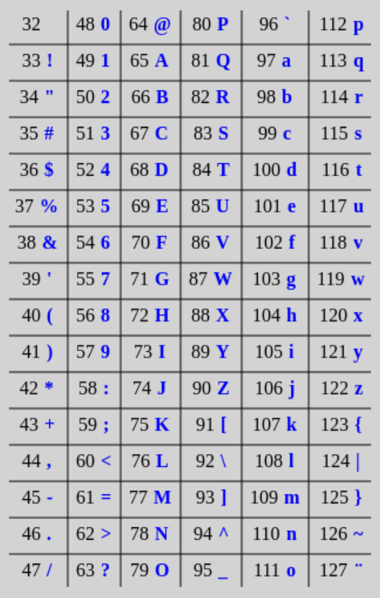

# KAIST 2024f CS101 HW3
This Markdown file was created by me, John Park (farawell777 (at) kaist (dot) ac (dot) kr).
If you encounter any issues, please do not hesitate to contact me via email.
Additionally, there may be typographical errors or inaccuracies in the examples or explanations, as some content was copied directly from the original instructions. Should you notice any errors, please feel free to reach out to me.

Furthermore, I strongly advise against directly using my codes for your assignments, as it constitutes academic dishonesty and will be easily detected by CS101 TAs. Just use my codes for studying.

## Task 1-1 Email Registration for KAISTPay
A part of making good software is preventing invalid inputs from the users. In KaistPay, we are going to check if the email address given by the user is valid. 

A valid email address contains an email prefix and email domain. The email prefix appears to the left of the ‘@’ symbol, while the email domain appears to the right of the ‘@’ symbol. For the mail address to be valid, the email prefix and the email domain must adhere to the following rules:

1. Email prefix:
Only includes letters, numbers, underscores, periods, and dashes
An underscore, period, or dash must be followed by at least one letter or number

2. Email domain:
Only includes letters, numbers, periods, or dashes
The last portion of the domain must be a well-known domain. “Well-known” domain endings are predefined as a set of strings, well_known. For example,
well_known = set({‘com’, ‘edu’, ‘kr’}) # and more…

Implement is_email(s), a helper function designed to check if the email address given by the user is valid. 

is_email(s:str)
Returns True if the value of s is a valid email address.	If it is invalid, return False.

**Example**:
```
well_known = set({‘com’, ‘edu’, ‘org’, ‘kr’})
print(is_email(‘cs101@kaist.ac.kr’))
print(is_email(‘cs1-1@elice.io’))
```

--------------------Execution-----------------------
True 
False

## Taks 1-2 Password Encryption
Imagine if a malicious hacker breaks into our program and steals the user database. If all the data is stored as is, the hacker will be able to know all the users’ private information. Thus, by law, system administrators must store private information, such as the password, in an encrypted form. This way, even if a hacker manages to break into the database, they will only get useless gibberish.

For KaistPay, we will implement a very simple encryption algorithm based on Caesar cipher. In Caesar cipher, each letter in a string is replaced by a fixed number N (N > 0) of positions down the alphabet. For example, the string ‘abcd’ can be encrypted as ‘cdef’ where N = 2. For more information, refer to this [link](https://brilliant.org/wiki/caesar-cipher/).

We will modify the Caesar cipher to replace each letter in a string by a fixed number of N positions down the ASCII table. For more information about the ASCII table, refer to this [link](https://www.ascii-code.com/).



We will only use the character codes 32-126, which are the printable characters except for ‘DEL’ (127). Thus, if the code goes beyond 126 in the ASCII table, it should come back to 32. For example, shifting the ‘~’ character (126) by N=5 will result in ‘$’ (36).

Using this information, implement encrypt_password(pwd, n). 
Hint: You can convert a character to its ascii-value integer using the ord() function, and an integer to a character using the chr() function. For example, ord('A') returns 65, and chr(65) returns 'A'.

encrypt_password(pwd: str, n: int)
Returns the encrypted password string shifted by N=n. 

Example:
print(encrypt_password(‘abcd1234’,5))
print(encrypt_password('MySecret1234!@#$', 30))

--------------------Execution-----------------------
fghi6789
k8q$"1$3OPQR?^AB

## Task 2 User Registration
Now we will implement the registration code for KaistPay. We will implement the user database Users_DB using the dictionary type. Specifically, the DB will store the user information with the following structure:

```
Users_DB(dict <int:dict>) = {
    student_ID (int): {
    'name': str, 
    'email': str,
    'password': str,
    'type': int,
    'balance': int
    }
}
```

We will store the Users_DB as a global variable. Assume that the user will provide the student ID, name, email address, and password. For the registration, you should check that the given email is valid using the function you implemented in Task 1-1, and that the user is not already registered on the DB. If any of these conditions are not met, the function should cancel the registration and return False. 

The name and email should be stored as given by the user. The password given by the user should be encrypted using the function implemented in Task 1-2, where N = length of the password. The student ID will be an 8-digit long integer. Copy and paste is_valid and encrypt_password functions from the previous tasks.

The type of user is determined by the 5th number from the left of the student ID:
-  If the 5th number is 0 or 1, type = 0, representing undergraduate.
-  If the 5th number is 2 or 3, the type = 1, representing the Master’s program.
-  If the 5th number is 4 or 5, the type = 2, representing the Ph.D program.

Finally, the balance should be 0 for all new users.

With this information, implement register_user(student_id, name, email, pwd).

register_user(id, name, email, pwd) 
Register the user to KaistPay user DB. Returns true if registration was successful. Returns false if registration was unsuccessful.

**Example**:
```
print(register_user(20245000, 'GilDong Hong', 'gildong.hong@kaist.ac.kr', 'abcd1234'))
print(register_user(20241000, 'GilDong Park', 'gildong.park@kaist.ac.kr', 'MySecret1234!@#$'))
print(register_user(20241000, 'GilDong Park', 'gildong.park@kaist.ac.kr', 'MySecret1234!@#$'))
```

--------------------Execution-----------------------
```
True
True
False
```

-----------------Value of Users_DB------------------
```
{
    20245000: {
        "name": "GilDong Hong",
        "email": "gildong.hong@kaist.ac.kr",
        "password": "abcd1234",
        "type": 2,
        "balance": 0
    },
    20241000: {
        "name": "GilDong Park",
        "email": "gildong.park@kaist.ac.kr",
        "password": 'MySecret1234!@#$',
        "type": 0,
        "balance": 0
    }
}
```

## Task 3 Transaction Records & Bad User Detection
### Task 3-1: Recording Transactions
When KaistPay users recharge their accounts or make payments using KaistPay, a transaction record will be generated and stored in our database, Transactions_DB. Each transaction is a tuple consisting of the student ID, type of the student, amount, and final_amount, as shown below:

```
Transactions_DB(list) = [
   (student_ID: int, type: int, amount: int, final_amount: int)
]
```

Note that a positive amount represents recharging the account, while a negative amount represents payment. To benefit the users of KaistPay, there is a discount rate associated with each type of user. For each payment, undergraduates (type 0) receive a 20% discount, and Masters (type 1) receive 10%. There is no discount for the Ph.D students. Thus, in the transaction tuple, amount represents the original amount while final_amount  represents the discounted amount, rounded to the nearest integer. The discount should only apply to payments and not to recharges.

To make a successful transaction, the student_ID should be registered in the Users_DB. Also, no payment should be allowed beyond the current balance. In any of these cases, the function should end and return False. Finally, if the transaction was successfully added to the Transactions_DB, the user's balance should be changed accordingly in the Users_DB. 

Now let’s implement add_transaction(student_ID, amount). Remember that a positive amount represents charging the balance while a negative amount represents payment.

add_transaction(student_ID, amount) 
Add a transaction tuple to the Transactions_DB (list). Returns true if successful, false otherwise.

**Example**:
```
register_user(20245000, 'GilDong Hong', 'gildong.hong@kaist.ac.kr', 'abcd1234')
register_user(20241000, 'GilDong Park', 'gildong.park@kaist.ac.kr', 'MySecret1234!@#$')
print(add_transaction(20241000, 10000))
print(add_transaction(20245000, 10000))
print(add_transaction(20241000, -10000))
print(add_transaction(20245000, -10000))
print(add_transaction(20245000, -10000))
```

--------------------Execution-----------------------
```
True
True
True
True
False
```

------------Value of Transactions_DB----------------
```
[
    (20241000, 0, 10000, 10000),
    (20245000, 2, 10000, 10000),
    (20241000, 0, -10000, -8000),
    (20245000, 2, -10000, -10000)
]
```

-----------------Value of Users_DB------------------
```
{
    20245000: {

        ...

        "balance": 0
    },

    20241000: {

        ...

        "balance": 2000
    }
}
```

### Task 3-2: Detecting and Removing Bad Users
A vulnerability issue has been found that allows some users of KaistPay to maliciously access the Users_DB and modify their balance value in Users_DB in an attempt to use KaistPay without recharging. Fortunately, they could not access the Transactions_DB, which contains the history of transactions. Using the Transactions_DB, we will find all the users who maliciously changed their balance and remove them from the Users_DB.

Implement function detect_bad_users(), which removes any user whose balance does not match the balance derived from the transaction records. The function should return the list of student IDs that were deleted. If no user was deleted, the function should return an empty list. Note that the values of Transactions_DB should not be modified in this function and that Transactions_DB will remain the same even after some users have been deleted from the Users_DB.

detect_remove_bad_users() : int
Removes any user whose balance does not match the transaction records

**Example**:
```
register_user(20245000, 'GilDong Hong', 'gildong.hong@kaist.ac.kr', 'abcd1234')
register_user(20241000, 'GilDong Park', 'gildong.park@kaist.ac.kr', 'MySecret1234!@#$')
add_transaction(20241000, 10000)
add_transaction(20245000, 10000)
add_transaction(20241000, -10000)
add_transaction(20245000, -10000)
Users_DB[20241000]['balance'] = 99999999
bad_users = detect_remove_bad_users()
print(bad_users)
```

--------------------Execution-----------------------
```
[20241000]
```

------------Value of Transactions_DB----------------
```
[
    (20241000, 0, 10000, 10000),
    (20245000, 2, 10000, 10000),
    (20241000, 0, -10000, -8000),
    (20245000, 2, -10000, -10000)
]
```

-----------------Value of Users_DB------------------
```
{
    20245000: {

        ...

        "balance": 0
    }
}
```
